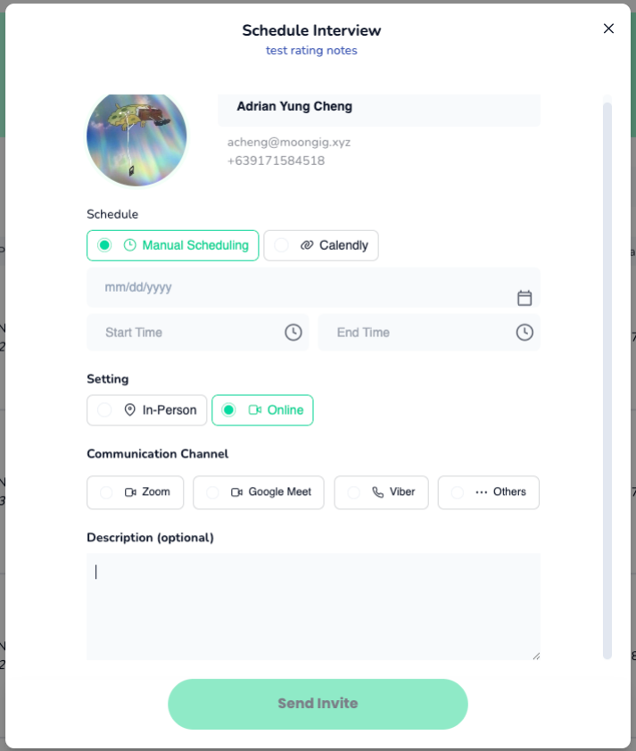

# Release 09.26.2025

## Various Apps Communication Channels

* You can now choose from multiple communication channels when **manually scheduling an interview** (Zoom, Google Meet, Viber, or Others).
* Once a channel is selected, you’ll be prompted to enter the meeting link.
* **Note:** Communication channels are only available for manual scheduling.

**Provider side preview:**

<figure><figcaption>
Step 1: Select Manual Scheduling -> Online
</figcaption></figure>

<figure><figcaption>
Step 2: Select Communication Channel then input link
</figcaption></figure>

**Professional App Preview:**\

<figure><figcaption></figcaption></figure>

\

## Prefilled Interview Notes

When adding a job applicant note, the **Interviewer** and **Date of Interview** fields are now automatically pre-filled with:

* The signed-in user as the interviewer.
* Today’s date as the interview date.

<figure><figcaption></figcaption></figure>

## Prio/Deprio Levels

* The **Profiles Admin page** (restricted to selected users) now supports two levels of deprioritization:
  * **Deprio 1 (Deprioritized):**
    * Lowest priority.
    * Can still take shifts and receive notifications.
  * **Deprio 2 (Suspended by Provider):**
    * Can apply but will not be assigned shifts for that provider.
    * Will not receive notifications from that provider.
* The **Prio/Deprio form** has been redesigned:
  * You can now assign different priority or deprioritization levels per provider.
  * Use the **“Add Client”** button to apply prio/deprio settings for a specific client.

<figure><figcaption>
Profiles - Admin Page
</figcaption></figure>

<figure><figcaption>
Deprioritization Form
</figcaption></figure>

<figure><figcaption>
Preview after clicking "Add client"
</figcaption></figure>

<figure><figcaption>
Deprio Levels
</figcaption></figure>

