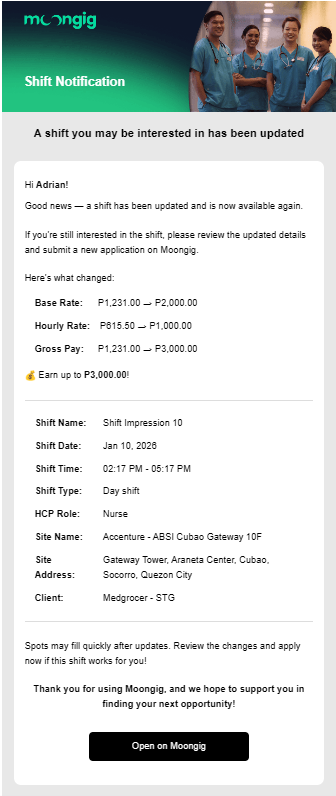
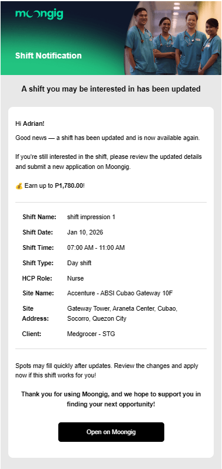

# Release 01.08.2026

## New Shift & Job Metric: Impressions

We’re introducing **Impressions**, a new performance metric that helps recruiters understand the visibility of their Job or Shift Ads across Moongig, even when users don’t click on them.

**What’s New?**

* An impression is counted when:
  * A job or shift card enters the user’s visible screen area
  * It remains visible for at least 1 second
* Note that a tap or click is not required, and scrolling past too quickly won’t count as one 

**Impressions vs Views**

To avoid confusion, here’s how the two metrics differ:

* **Impressions:** counted when an ad appears on a user’s feed, even if they don’t open it
* **Views:** counted only when a user opens the job/shift details and stays for atleast 3 seconds

<figure><figcaption></figcaption></figure>

## Provider Login Page Rework

We’ve refreshed the **Provider Login Page** to better showcase Moongig’s value while making the sign-in more welcoming.

<figure><figcaption></figcaption></figure>

 

## Notification Changes

We’ve expanded our notifications to keep Recruiters and Users better informed about important updates.

**What’s New?**

* **Shift Reset Notification**
  * Previously, users would receive a "New Shift Available" alert even if a shift was simply being updated or reset. Now, non-applicants will receive a Shift Updated email that clearly highlights exactly what changed.

<figure><figcaption></figcaption></figure> <figure><figcaption></figcaption></figure>

* **Upcoming Interview Reminder**
  * To reduce no-shows and last-minute confusion, an email reminder is sent **4 hours before** and **1 hour before** the interview. This ensures all parties are aware of upcoming interviews and can prepare in advance.
*   **Interviewer Mobile Number Added**

    * Interview confirmation emails now include the interviewer’s mobile number, making it easier for recruiters and users to coordinate in case of delays, questions, or urgent updates. 

    <figure><figcaption>
1 hour before
</figcaption></figure>

<figure><figcaption>
4 hours before
</figcaption></figure>

## Bug Fixes

* Fixed missing overseas flag on international job postings on search page.
* Fixed name validation to block numbers and allow only letters, so users no longer get stuck during signup.
