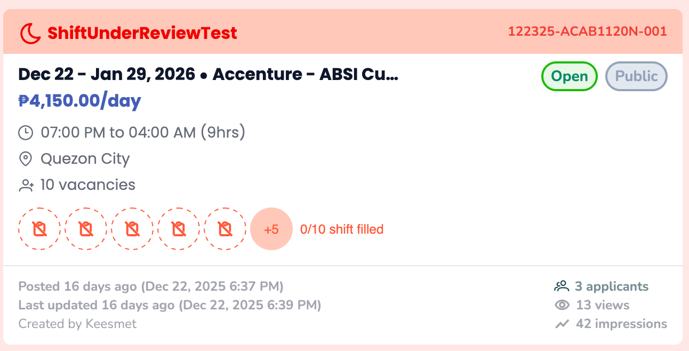

# Release 02.20.2026

## New Profile Creation (V1)

We’ve launched a new **Profile Creation experience** that makes signing up faster and ensures applicants complete all required information before applying to Jobs and Shifts.

This release improves onboarding clarity, document handling, and application success rates.

**What’s New:**

* **Simpler Signup**
  * Healthcare Professionals (HCPs) can now complete sign-up and start browsing immediately.
  * After entering:
    * Login credentials
    * Email verification
    * Profession
  * They are redirected straight to the **Home screen.**
  * Previously, users were required to complete CV extraction before browsing. Now, they can explore jobs and shifts right away and complete missing requirements only when applying.

<figure><figcaption>
Sign up flow
</figcaption></figure>

* **Apply to Job**
  * When users tap **Apply**, the system checks profile completeness.
    * If profile is complete and verified
      * Application is submitted instantly
      * User sees a success message
      * Client can immediately view the application
    * If a requirement is missing, they will be redirected to the **Missing Requirements** screen.&#x20;
      * This screen clearly shows:
        * Company photo and job name
        * A checklist of required information, which may include:
          * Profile photo
          * Mobile number
          * Sex
          * Birthdate
          * Address
          * Required documents (depending on the job and profession)
      * When uploading a CV, the extraction will proceed. If successful, HCPs can review and edit their work experience before saving.

<figure><figcaption>
Job application - Missing Documents Screen
</figcaption></figure>

\
 

* **Apply to Shift**
  * The shift application flow follows the same process as Job applications.
  * Once the HCP has been **Approved for a Shift** and is about to **Accept the Contract**, an additional validation step is introduced. Before contract acceptance, the user will be prompted to complete:
    * Payout information
    * TIN information

<figure><figcaption>
Shift application - Missing documents screen
</figcaption></figure>

* **After submission of missing requirements for both Jobs and Shifts**
  * The profile is sent to MedOps for verification.
  * Once approved, the job/shift application automatically proceeds.
  * No re-application is required.
* **Important Improvements**
  * The submit button stays disabled until all required items are complete.
  * Users can go back anytime without losing progress.
  * Uploaded files are saved.
  * Returning users continue where they left off.
  * Profiles are reviewed only after all required documents are uploaded.

This release makes the application process clearer, more flexible, and easier to complete, helping HCPs apply with confidence and helping clients receive complete applications faster.

 

\
\
 
