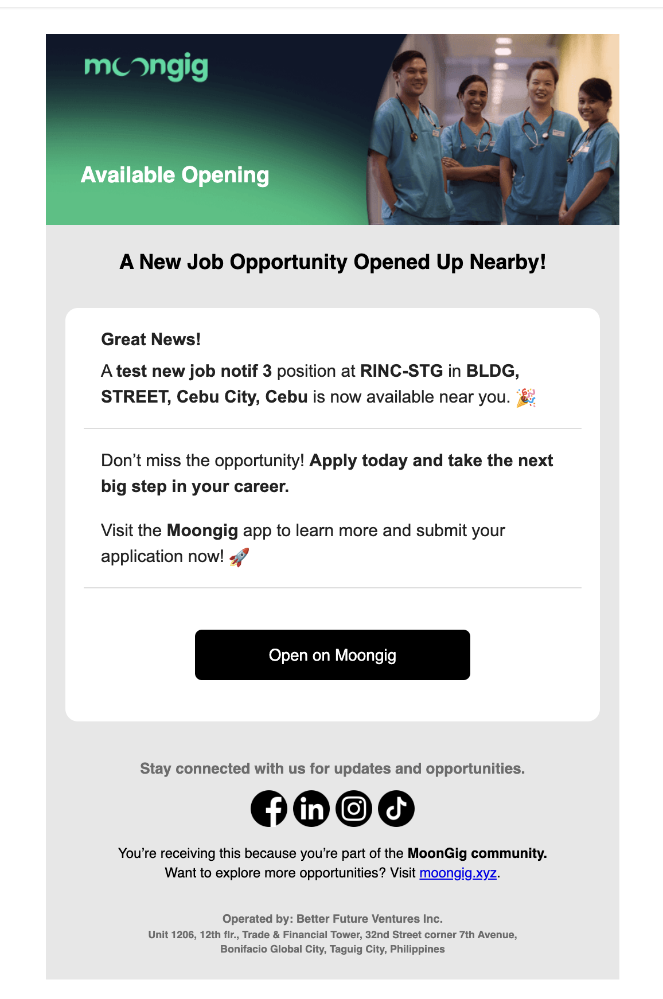
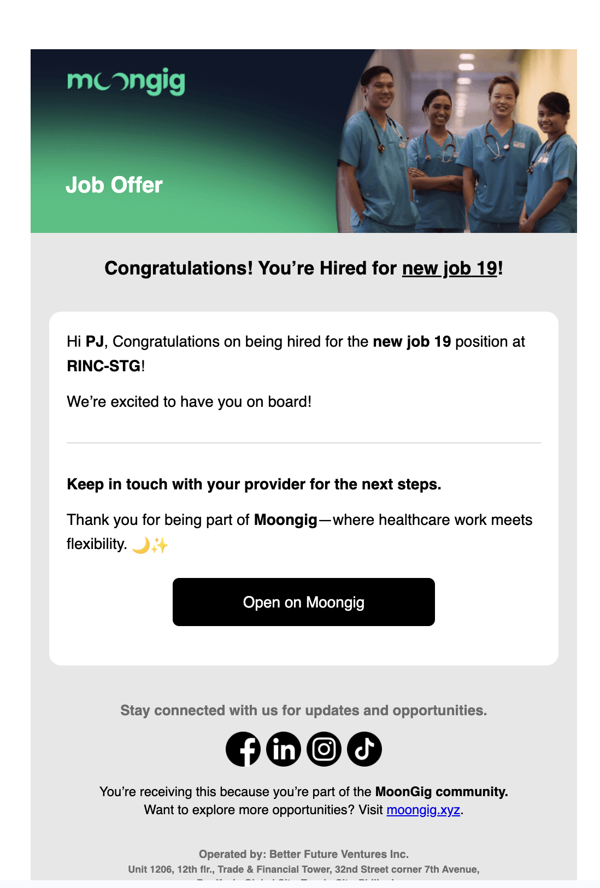

# Release 10.01.2025

## Mailtrap Templates Integration

We've integrated **Mailtrap email templates** into the system, making it easier to edit and manage the emails sent to users.

**Integrated Job Notification Templates**

**Professional/HCP Emails**

* Nearby Job
* Saved Job Nearing Application Deadline
* Job Interview Scheduled (Manual Scheduling)
* Book Calendly Schedule
* Job Interview Reminder
* Job Interview Cancelled
* Job Offer
* Hired
* Rejected

**Provider Emails**

* New applicant
* Job Interview Schedule Confirmed
* Interview Schedule: HCP unavailable

#### Professional/HCP Emails

**Nearby Job**

<figure><figcaption>
Nearby Job
</figcaption></figure>

**Saved Job Nearing Application Deadline**

<figure><figcaption>
Saved Job Nearing Deadline
</figcaption></figure>

**Interview Scheduled (Manual Scheduling)**

<figure><figcaption>
Interview Scheduled
</figcaption></figure>

**Book Calendly Schedule**

<figure><figcaption></figcaption></figure>

**Job Interview Starting Soon**

<figure><figcaption>
Interview Starting Soon
</figcaption></figure>

**Job Interview Cancelled**

<figure><figcaption>
Interview Cancelled By Provider
</figcaption></figure>

**Job Offer**

<figure><figcaption>
Job Offer
</figcaption></figure>

**Hired**

<figure><figcaption>
HCP Hired
</figcaption></figure>

**Rejected**

<figure><figcaption>
Rejected
</figcaption></figure>

#### Provider Emails

**New applicant**

<figure><figcaption>
HCP Applied
</figcaption></figure>

**Job Interview Schedule Confirmed**

<figure><figcaption>
HCP Accepted Interview
</figcaption></figure>

**Interview Schedule: HCP unavailable**

<figure><figcaption>
Interview Unavailable
</figcaption></figure>
