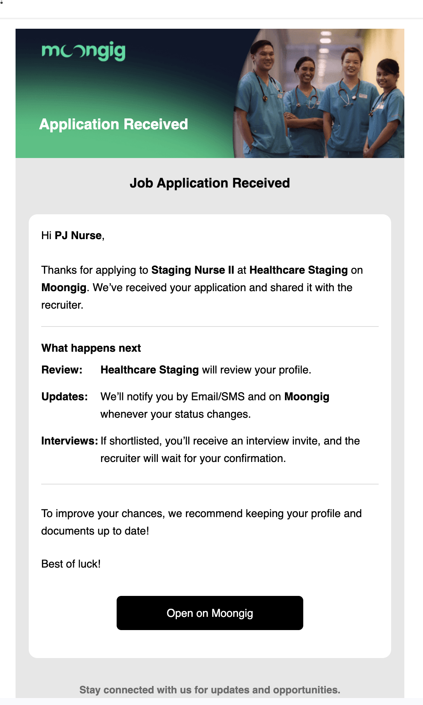

# Release 10.10.2025

## Opt In to Notifications

* **New users** are now prompted to **opt into shift and job notifications** right after creating their account.&#x20;
* **Existing users** will see the same modal the next time they open the app. The modal toggles for both notification types should be **ON by default**.
* Users can later manage these notification preferences under **Account → Notifications.**
* If **Shift Notifications are turned off**, the user will not receive notifications about new or recommended shifts. However, if they apply to a shift, they will still receive notifications related to that specific shift, such as reminders, payout updates, or confirmation status.
* Similarly, if **Job Notifications are turned off,** the user will not get job recommendation alerts, but they will still receive notifications related to jobs they have applied for, including status updates and interview reminders.

<figure><figcaption>
Opt in to notifications modal
</figcaption></figure>

<figure><figcaption>
Notification Settings
</figcaption></figure>

## Landing Page - Improvements

#### Filtering Optimizations

Improve filtering on the landing page to make job/shift discovery faster and more accurate.

<figure><figcaption>
Locations - Filter
</figcaption></figure> <figure><figcaption>
Company - Filter
</figcaption></figure> <figure><figcaption>
Experience Level - Filter
</figcaption></figure> <figure><figcaption>
Employment Type - Filter
</figcaption></figure>

#### Company Directory

We've added a new **Company Directory** page for HCP applicants. This allows users to know which companies are hiring and can explore opportunities.

**Key Features:**

* Added a list of all companies with their **company name, logo, description, and # of openings.**
* **Search and filter** companies by **name, professions,** or **location**.
* **Click a company** to open their profile page and view available job/shift postings.
* **Top hiring companies** are displayed at the **top of the list.**

<figure><figcaption>
Company Directory
</figcaption></figure>

## Email Content Changes

### Auto-**acknowledgment email**

An **acknowledgment email** is now automatically sent to an **HCP** immediately after they apply to a job.

<figure><figcaption></figcaption></figure>

### Failed payout email

We are now sending **different email content** when a payout fails, instead of using the same message for all cases.

* **Failed payout due to error in receiving bank.**
* **Failed payout due to incorrect bank/e-wallet details.**

<figure><figcaption>
Failed payout due to error in receiving bank
</figcaption></figure> <figure><figcaption>
Failed payout due to incorrect bank/e-wallet details
</figcaption></figure>

## Bug Fixes/Improvements

**Professional app**

* Featured providers are now displayed at the **top of the Providers list** for better visibility

**Client Portal**

* Added a **warning pop-up** when clicking **Unpublish Shift** to prevent accidental actions.
* Moved the **Unpublish** option to the **bottom of the dropdown menu** to reduce misclicks.
