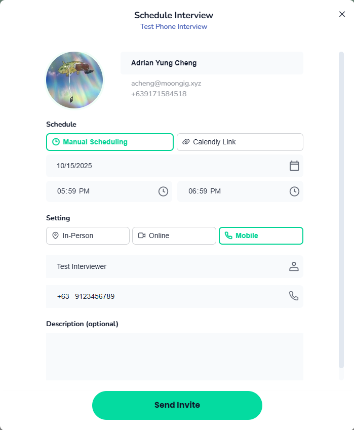
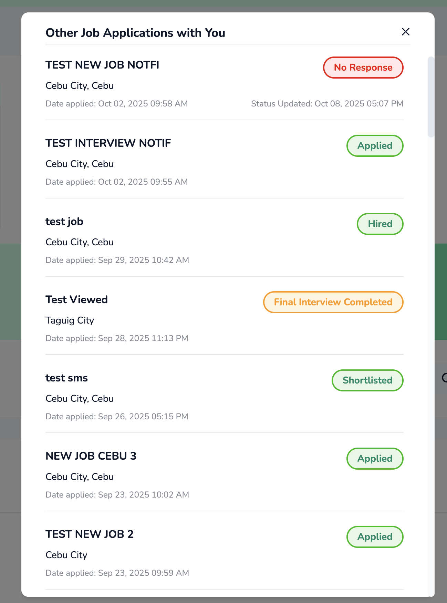
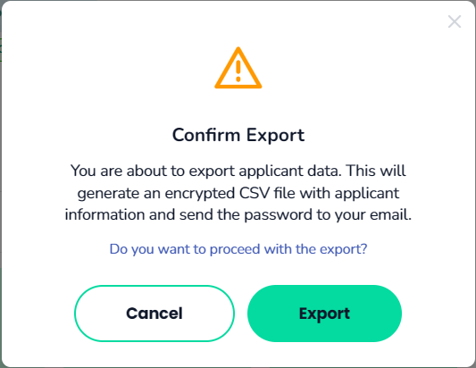

# Release 10.16.2025

## Shift Changes

### Emergency Funds & Allowance

We’ve added **two new fields** under the **Compensation** section during shift creation:

* **Emergency Funds**
* **Allowance**

<figure><figcaption>
Shift Creation with Emergency Funds &#x26; Allowance
</figcaption></figure>

<figure><figcaption>
Shift Summary (Shift Creation)
</figcaption></figure>

During **shift application review**, **Emergency Funds** and **Allowance** are **always visible**, but can **only be edited if the shift has not been paid**.

<figure><figcaption>
Shift Review with Emergency Funds &#x26; Allowance
</figcaption></figure>

* Once paid, the values will be displayed on the **HCP’s side** as follows:
  * **Emergency Funds** under _Priority Surcharge_
  * **Allowance** under _Allowances_
* **HCPs** can view these values in:
  * The **“What is Included”** modal
  * The **Payout Breakdown** page
  * The **Payslip**

<figure><figcaption>
What is included - Modal
</figcaption></figure> <figure><figcaption>
Payout breakdown page
</figcaption></figure>

 

<figure><figcaption>
Payslip
</figcaption></figure>

## Job Changes

### Phone Interview Option

* You can now select **Mobile** as a communication channel when scheduling an interview.
* When **Mobile** is selected, you’ll be prompted to enter the **interviewer’s name** and **phone number**.
* **Note:** Phone interview option is only available for manual scheduling.
* An **email notification** will be sent to the HCP, including the interviewer’s name and phone number.

<figure><figcaption>
Schedule Interview - Phone Interview Option
</figcaption></figure>

<figure><figcaption>
Phone Interview - Email
</figcaption></figure>

### Scheduled Interview List

We’ve added a new page for **Providers and Recruiters** to view a **consolidated list of scheduled interviews**, along with their current status (_Scheduled, Confirmed, Cancelled,_ or _Completed)._

**Key Features:**

* Accessible by selecting an **Interview State card** (e.g., _For Interview, 2nd Interview, 3rd Interview_) and clicking **View Interviews** at the top-right of the screen.
* Each Interview State has its own **View Interviews** button.
* The list displays:
  * Candidate name
  * Role applied for
  * Interview date & time
  * Mode (e.g. In-Person, Online)
  * Current status
* Recruiters can **filter interviews** by status (_Scheduled, Confirmed, Cancelled, Completed_).
* When an interview is **rescheduled**, the list automatically updates to show the latest time.
* Recruiters can **manually update** an interview’s state (Confirmed, Cancelled, or Completed) using the **action button** beside the candidate’s row.

**Status Definitions:**

* **Scheduled** – Interview has been scheduled but not yet confirmed by the applicant.
* **Confirmed** – Applicant has confirmed their attendance in the app.
* **Completed** – Interview has been conducted.
* **Cancelled** – Interview was cancelled by either the applicant or the provider.

<figure><figcaption>
Job details Page with View Interviews button
</figcaption></figure>

<figure><figcaption>
Scheduled Interview List
</figcaption></figure>

### For Interview Section UI Changes

We’ve updated the **HCP view under Jobs** to better highlight job applications that are **scheduled for interview**. This will make it easier for HCPs to identify and track their interview-related applications.

<figure><figcaption>
For Interview Section Update
</figcaption></figure>

\

### Past shifts and job applications

We’ve added a new feature that allows **Providers and Recruiters** to view an applicant’s **past shift/job application history** with their company.

For each applicant, recruiters can see:

* Count of past completed shifts with the provider.
* Other job applications submitted to this provider.
* Each application’s **current status, applied date**, and **last updated date.**

This update helps recruiters make more informed hiring decisions by providing better context on an applicant’s previous interactions with their company.

<figure><figcaption>
Job applicant history
</figcaption></figure>

<figure><figcaption>
Other Job Applications with you
</figcaption></figure>

## Bug Fixes & Improvements

### Viewed State

We’ve fixed an issue where the **viewed state** of applicants was **shared across all provider accounts**.\
The **viewed state is now tracked separately per provider account**, ensuring that when one account views an applicant, it will not appear as viewed for others.

### Shared Shift Link Access

* Fixed an issue where **logged-out users** who clicked **“View Shift Details”** from an the **"New Nearby Shift"** email were redirected to a **loading or empty screen**.
* The shared shift link now loads **properly for all users**, even when not logged in.

### Export confirmation popup

We’ve added a **confirmation popup** when exporting applicant data. Users will now be prompted to **confirm the export action** to ensure they intend to proceed before the data is exported.

<figure><figcaption>
Job Action Dropdown
</figcaption></figure>

<figure><figcaption>
Export Confirmation Popup
</figcaption></figure>

