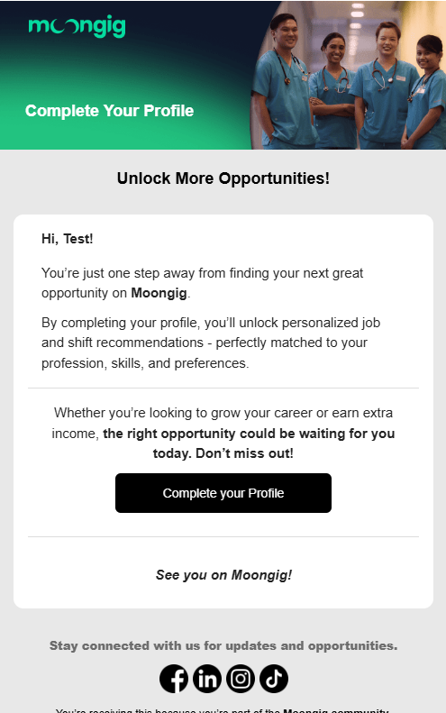
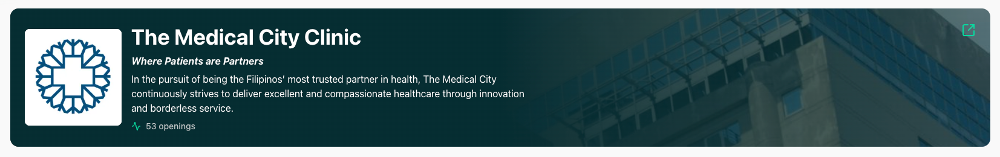
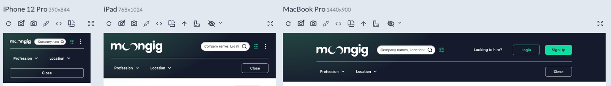

# Release 10.23.2025

## Other Payments

We’ve added a new feature that allows **Moongig payout admins** to release payments to other users such as **Ambassadors**.\
This functionality is available **only to the “Moongig” client**.

<figure><figcaption></figcaption></figure>

\

**How to Release a Payment**

1. **Switch to the Moongig client.**
2. Ensure your account has **payout admin access** (contact the Tech Team if access is needed).
3. Navigate to the **Payout Page** and open the new **“Others”** tab.
4. Click **New Payout** and fill in the required fields:
   * **Name of the user**
   * **Transaction type (See table below for the list)**
   * **Covered start and end date**
   * **Amount (Gross amount)**
   *   **Applicable taxes** – None, 5%, or 10%

       > 💡 The payout amount is **gross amount minus applicable taxes**\
       > e.g., ₱500 gross with 5% tax = ₱475 payout.
5. The **user’s payout details** will automatically appear once a user is selected.
6. Review all details carefully before confirming.
7. Once confirmed, the **payout will be released instantly**, provided there are no issues with the receiving bank or payout details.

**Transaction Types**

> Note: FGD participation types are currently disabled.

| FGD participation - Online _(disabled for now)_    |
| -------------------------------------------------- |
| FGD participation - In-person _(disabled for now)_ |
| Successful Referral                                |
| Successful Shift Application                       |
| Successful Job Application                         |
| Ambassador program - Quota                         |
| Ambassador program - Allowance                     |

<figure><figcaption>
Payout admin page - Other Payout
</figcaption></figure>

Users will see the payment reflected in their **app** under their **transactions page**, with details such as transaction type, date, and credited amount.

<figure><figcaption>
User Transactions Page
</figcaption></figure>

## Quick sign up for Ambassadors

To support payments for other **users** such as **Ambassadors**, we’ve added a **new quick sign-up page** that allows them to easily register and receive payments directly in the app.

<figure><figcaption>
Sign up fast - step 1
</figcaption></figure> <figure><figcaption>
Sign up fast - step 2
</figcaption></figure> <figure><figcaption>
Sign up fast - step 3
</figcaption></figure>

**Profile Creation – Required Fields**

* Full Name
* Mobile Number
* Sex
* Birthdate
* Address (Street, City, Barangay, Zip Code)
* Bank Details

<figure><figcaption>
Sign up fast - profile creation
</figcaption></figure> <figure><figcaption>
Sign up fast - profile creation filled
</figcaption></figure> <figure><figcaption>
Sign up fast - verification status popup
</figcaption></figure>

Users who sign up through this page will have access to only two sections:

* **Transactions** – View released payments or earnings.
* **Account** – View and update personal and bank details.

<figure><figcaption></figcaption></figure> <figure><figcaption></figcaption></figure>

**Verification Process**

* After signing up, users are initially tagged as **“For Verification.”**
* Once approved by the team:
  * **Ambassadors** are marked as **Verified** and receive their **unique referral code.**

<figure><figcaption>
For ambassadors
</figcaption></figure> <figure><figcaption>
Verified Profile
</figcaption></figure>

#### Referral Code Usage

Ambassadors can now share their **unique referral code** with potential new HCPs.\
When a new HCP registers in the app using an ambassador’s referral code, the referral will be **logged in the system** and can later be **verified and processed manually** for incentive credit.

<figure><figcaption></figcaption></figure>

## Email & Notification Changes

### New Site Notifications

Admins can now trigger **New Site Notifications** to alert users about newly added sites.

<figure><figcaption>
New Site Notification
</figcaption></figure>

\
**How to trigger:**

1. Must be an **admin**.
2. Navigate to **Shift Locations** and click **Announce New Site**.
3. Fill out all required fields: **Profession, Region, City, Area Name, Nearby City Radius**.

<figure><figcaption></figcaption></figure>

### Incomplete Profile

HCPs with **incomplete profiles** will now receive automated email reminders:

* **First reminder:** After 24 hours.
* **Follow-up reminder:** After 72 hours (if still incomplete).

<figure><figcaption>
Incomplete Profile email.
</figcaption></figure>

### Transition to Mailtrap Templates

All **Shift** and **Account** email notifications have now been fully migrated to **Mailtrap templates** for improved management and consistency.

> **Note:** Template numbers (e.g., \[14], \[30], \[38]) refer to their corresponding template IDs in **Mailtrap** and can be searched there for easy reference.

#### Shift Notifications

**For HCPs**

* **\[15] Approve Shift Application** – Sent when a provider approves an HCP’s application.
* **\[16] Shift Confirmation** – Sent after the HCP accepts the contract.
* **\[17] Applicant Cancelled Shift** – Sent after cancelling their own application.
* **\[18] Shift Cancelled by MedOps** – Sent when the provider cancels a shift.
* **\[19] Shift Upcoming** – Sent 48h, 24h, 12h, 8h, 2h, and 1h before shift start.
* **\[20] Pre Check-In Reminder** – Sent 15 minutes before start.
* **\[24] Pre Check-Out Reminder** – Sent 15 minutes before end.
* **\[25] Shift Reviewed** – Sent after being reviewed by the provider.
* **\[26] 1st Payment Credited**
* **\[27] 1st Payment Credited (Multi-Day Shift)**
* **\[28] Final Shift Payout Triggered**
* **\[29] Missing Payout Details** – Sent if payout info is incomplete after check-in.
* **\[14] New Shift** – Sent when a new shift is created (if applicable to HCPs).

***

**For Providers**

* **\[30] HCP Applied Shift** – Sent when an HCP applies for a shift.
* **\[31] Applicant Confirmed Shift** – Sent when the HCP accepts the contract.
* **\[32] Shift Ready for Review** – Sent after the shift ends.
* **\[33] Applicant Cancelled Shift** – Sent when an HCP cancels their application.

#### Account Notifications (For HCPs)

* **\[34] Account Details Under Review**
* **\[35] Account Rejected**
* **\[36] Account Approved**
* **\[37] ID Near Expiration**
* **\[38] Account Temporarily Suspended**

## Landing Page Improvements

**Company Website Link Feature**

* **Desktop**: Users can visit a company's website by clicking either the provider card or the external link icon in the top-right corner,
* **Mobile**: Users can access the company's website by tapping anywhere on the provider card

<figure><figcaption></figcaption></figure>

**Responsive Styling Updates**

* Fixed responsiveness of the header to different mobile screens,
* Fixed header buttons styling

<figure><figcaption></figcaption></figure>

<figure><figcaption></figcaption></figure>

* Location filter is now persistent alongside the profession filter when navigating

## Bug Fixes

* Fixed an issue where users got stuck on the post-shift feedback screen after clicking **“Submit Feedback”** or **“No, thank you”** instead of being redirected to the main dashboard.
* Fixed issues where the tutorial incorrectly appeared during account creation, including after refreshing or revisiting the Terms of Service page and when overlapping with the Profile Review Successful screen after account approval.

