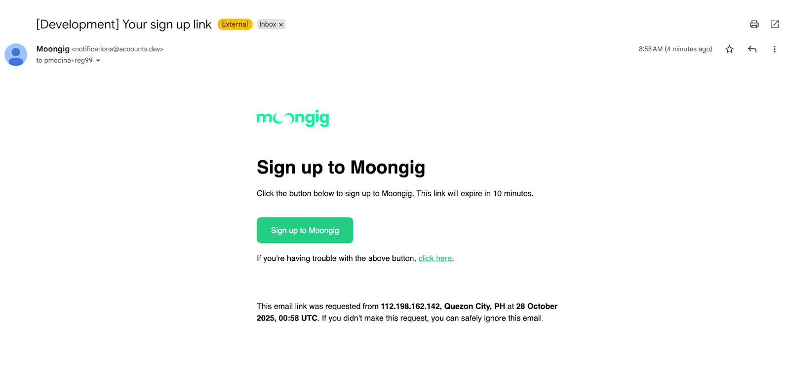
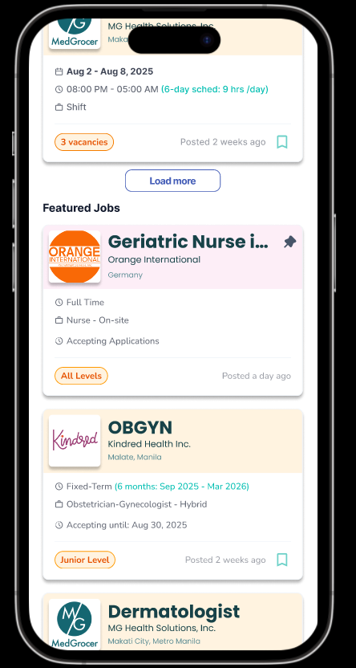

# Release 10.28.2025

## Streamlined Signup Process (Magic Link)

Our old sign-up process was causing huge drop-offs before accomplishing **Authentication Start** (65.9% Abandonment) and **Authentication Complete** (82.0% Abandonment). This was caused by the mandatory, multi-step process of switching between browser and email client for email verification, which is especially painful on low-end phones.

**What’s Changed**

We have replaced the "enter code" process with the new **Magic Link** authentication.

1. Users click a **secure, one-click** **button** in their email.
2. The button brings them **straight back to our app**, signed in and verified.

<figure><figcaption></figcaption></figure>

This new flow is the first step in our mobile-first strategy to maximize user activation.

## Improved Ad Interaction on Landing Page

As part of our ongoing effort to make finding healthcare opportunities seamless and intuitive, we've updated the job interaction flow for new users.

**What’s Changed**

The primary focus of this update is to allow potential healthcare professionals (HCPs) to **explore opportunities** **without commitment.** Therefore, they can quickly view Shift/Job ad details without logging in or signing up.

**For mobile view,** when you click a Shift/Job ad, you are now taken straight to the full, detailed description page.

* The **"Apply" button r**emains clearly visible, but it **no longer triggers an immediate sign-up modal** that blocks the application process.
* The application process now begins only _after_ you click "Apply." You'll be redirected to a single sign-up/login page.
* Crucially, once you complete the basic profile setup, the system automatically brings you **right back to the exact job or shift ad** **you were viewing**, allowing you to finish the application instantly.\

<figure><figcaption></figcaption></figure>

\

**For web view,** when you click a Job/Shift ad, you will land on the dedicated detail page and have full access to the description, requirements, and compensation **without any login prompt.**

* The **"Apply Now"** button on the details page now serves as the gateway to the application process.
* Clicking **"Apply Now"** takes you directly to the sign-up page (no more obstructing pop-up modals).
* Our system ensures that after you successfully sign up and complete the quick, basic profile setup, **you are instantly returned** **to the very same ad** you clicked from the beginning.

&#x20;

<figure><figcaption></figcaption></figure>

<figure><figcaption></figcaption></figure>

<figure><figcaption></figcaption></figure>

## Keywords and Input Limits for Companies (Admin)

We've made several updates behind the scenes to help companies present better information and improve their visibility:

* **Optimized Company Taglines and Descriptions**: We've introduced input limits for company taglines (max 35 characters) and descriptions (max 126 characters). This ensures company information displays beautifully and concisely on smaller mobile screens.
* **Better Search Results with Keywords:** Companies can now add keywords to their profiles. This feature is designed to improve the accuracy and relevance of search results, helping HCPs find the opportunities that match their skills faster.
* **Company Website Visibility:** We've added an **optional company website** field. If provided, users can now easily visit the company's official site directly from the job ad for further research.

<figure><figcaption></figcaption></figure>

## Bug Fixes/Improvements

**Signup Redirect Bug:**&#x20;

* When clicking an ad and getting redirected to the sign up/sign in process, users should be able to return to the same ad after setting up their account, instead of being redirected to the homepage.
* **Job Creation Fixes/Improvements:**&#x20;
  * Added a dropdown bar for currency selection (PHP, EUR) for overseas job postings.&#x20;
  * We also added an option to select options for Salary:\
    \- Range\
    \- Base (From X)\
    \- Max (Up to X)

<figure><figcaption></figcaption></figure>

<figure><figcaption></figcaption></figure>

* **Landing Page Fixes/Improvements:**
  * Fixed delay in filters after selecting a company
  * Added “Overseas” category on the landing page to filter Overseas jobs
  * Changed Job Ad color for overseas job ads
  * Pinned Orange International job ads on top
  * Renamed Filtered Jobs/Shifts to Available Jobs/Shifts

<figure><figcaption></figcaption></figure>

* Fixed an issue in the **Professional App** where the **“Documents Required”** modal did not appear after applying to jobs that required a diploma, allowing users without a diploma but with an uploaded CV to apply. The modal now correctly appears for all jobs with required documents.
* Fixed an issue where logged-in users who clicked on provider links such as [**moongig.xyz/p/tmcc**](https://www.moongig.xyz/c/tmcc) or [moongig.xyz/p/medgrocer](https://www.moongig.xyz/c/medgrocer) were not redirected properly. Logged-in users will now be redirected to the correct **provider view list** within the app.

\
